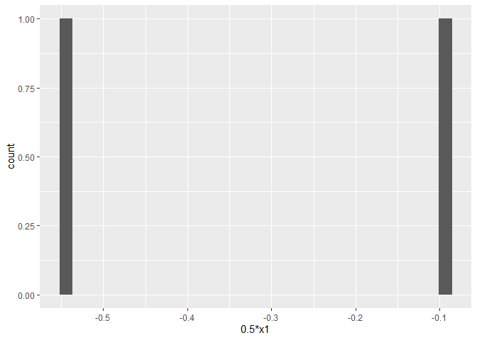
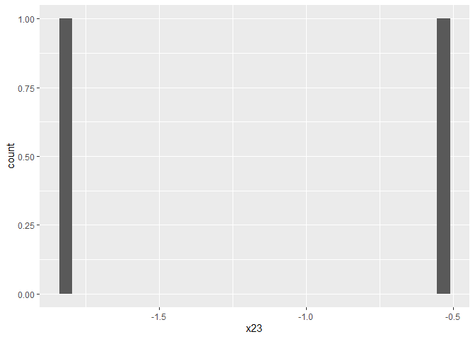

<!-- README.md is generated from README.Rmd. Please edit that file -->

# multiplyColumn

<!-- badges: start -->

<!-- badges: end -->

This package currently contains one function named multiplyColumn, which
takes a data frame, a column name (whose entries are numeric), and a
numeric value. It creates a new column that multiplies the entries of
the specified column with the input factor and returns the data frame
with this new column, as well as a histogram of the new column.

## Installation

You can install the development version of multiplyColumn from
[GitHub](https://github.com/) with:

``` r
# install.packages("devtools")
devtools::install_github("NaitongChen/multiplyColumn")
```

## Example

The following contains two example usages along with their outputs of
the only function in the multiplyColumn package.

``` r
# load packages
library(multiplyColumn)

# create data frame 
df = data.frame(matrix(rnorm(4),
        ncol=2, nrow=2,
        dimnames=list(NULL, c("x1","x2"))))

# examples
multiplyColumn(df, "x1", 0.5)
#> [[1]]
#>           x1         x2      0.5*x1
#> 1 -0.1820796 -0.5608388 -0.09103979
#> 2 -1.0839189  0.1929653 -0.54195943
#> 
#> [[2]]
#> `stat_bin()` using `bins = 30`. Pick better value with `binwidth`.
```



``` r
multiplyColumn(df, "x2", 3)
#> [[1]]
#>           x1         x2       3*x2
#> 1 -0.1820796 -0.5608388 -1.6825165
#> 2 -1.0839189  0.1929653  0.5788958
#> 
#> [[2]]
#> `stat_bin()` using `bins = 30`. Pick better value with `binwidth`.
```


